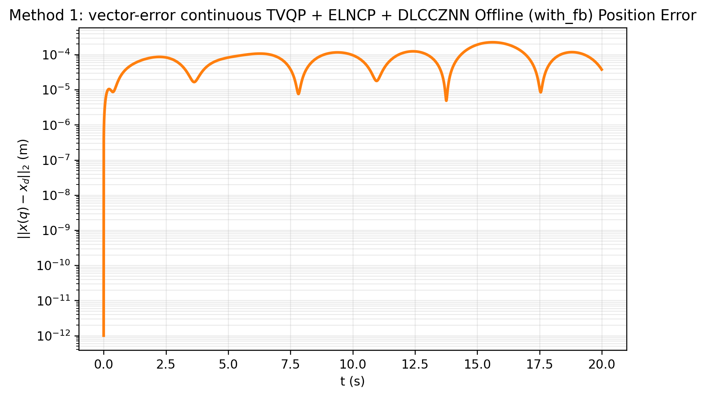
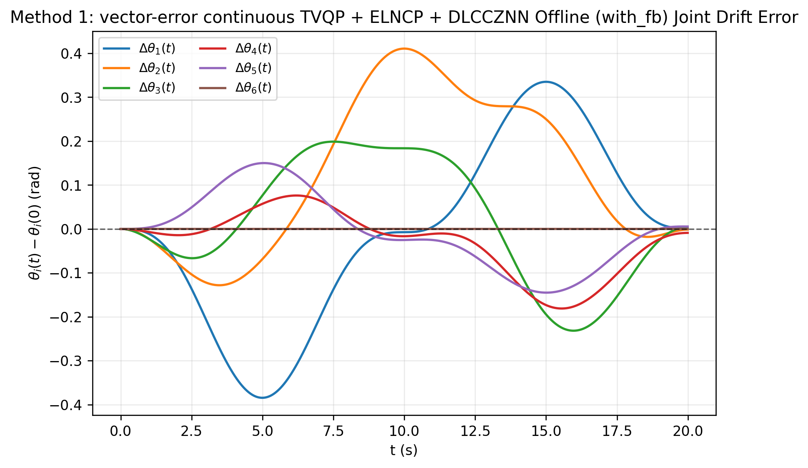
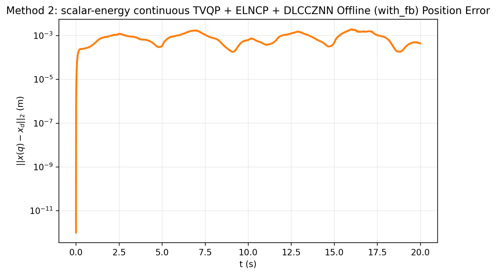
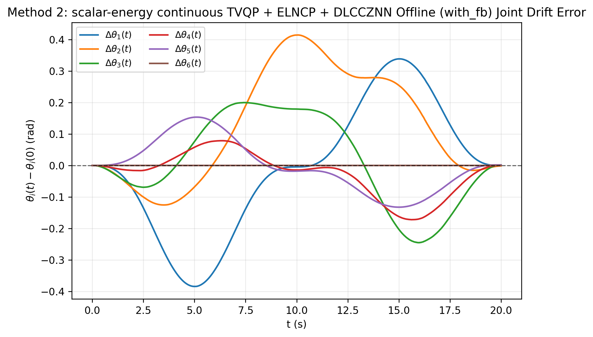
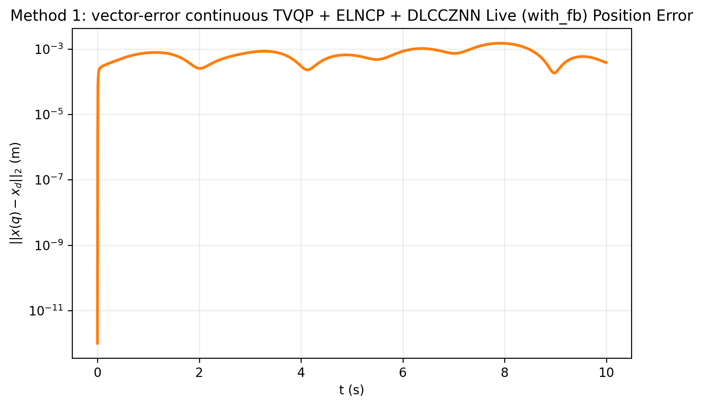
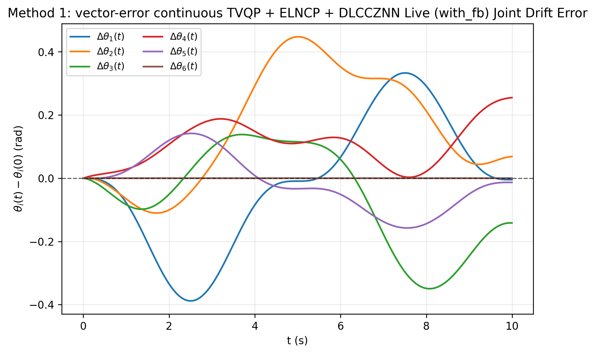
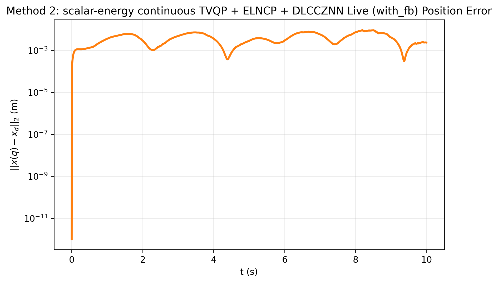
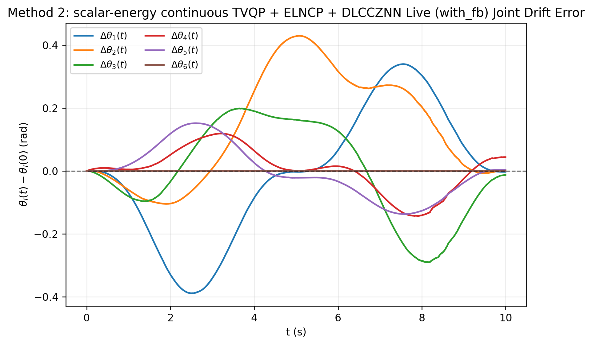

# 连续时变 TVQP + ELNCP + DLCCZNN 修正版实验报告

## 1. 修正目标

本次修正的核心是把方法重新拉回到目前确认正确的理论主线：

1. 漂移项严格采用 Zhang 2009 的经典 drift free 壳层

$$
z(t)=\lambda_d\bigl(q(t)-q_0\bigr).
$$

2. `Method 1` 处理向量残差

$$
F_y\dot y=-\gamma\Phi(F)-F_t.
$$

3. `Method 2` 处理标量能量

$$
v=\frac12\|F\|_2^2,\qquad \dot v=-\gamma\phi(v).
$$

之前人为加入的能量整形项

$$
g(v)=1+\kappa v^r\exp(\min(v,c_g))
$$

已经从主方法中删除。

## 2. 连续时变 QP 壳层

令

$$
u(t)=\dot q(t)\in\mathbb R^6,
$$

任务空间误差为

$$
e_p(t)=x(q(t))-r_d(t),
$$

关节漂移误差为

$$
e_d(t)=q(t)-q_0.
$$

Zhang 2009 的 drift free 项为

$$
z(t)=\lambda_d e_d(t)=\lambda_d\bigl(q(t)-q_0\bigr).
$$

其原始二次指标是

$$
\frac12\bigl(u(t)+z(t)\bigr)^T\bigl(u(t)+z(t)\bigr).
$$

展开得

$$
\frac12u(t)^Tu(t)+z(t)^Tu(t)+\frac12z(t)^Tz(t).
$$

由于最后一项与优化变量 \(u(t)\) 无关，因此等价 QP 为

$$
\min_{u(t)}
\frac12u(t)^T W u(t)+z(t)^T u(t),
$$

其中本实验取

$$
W=I.
$$

带反馈的任务速度为

$$
b(t)=\dot r_d(t)-k_p e_p(t).
$$

因此连续时变 QP 写为

$$
\min_{u(t)}
\frac12u(t)^T W u(t)+z(t)^T u(t)
$$

subject to

$$
J(q(t))u(t)=b(t),
$$

$$
\xi^-(t)\le u(t)\le \xi^+(t).
$$

动态速度边界为

$$
\xi_i^-(t)=
\max\left(
-\dot q_{\max},
\eta\frac{q_i^{\min}-q_i(t)}{\tau}
\right),
$$

$$
\xi_i^+(t)=
\min\left(
\dot q_{\max},
\eta\frac{q_i^{\max}-q_i(t)}{\tau}
\right).
$$

这里的 \(\tau\) 来自离散控制执行层，因此该边界属于采样安全意义下的时变边界。

## 3. ELNCP 残差系统

定义下界 slack 和上界 slack：

$$
a_i=u_i-\xi_i^-,
\qquad
b_i=\xi_i^+-u_i.
$$

ELNCP 降维后采用

$$
s_i(u,t)=\min(a_i,b_i)
=
\min(u_i-\xi_i^-,\xi_i^+-u_i).
$$

引入非负辅助乘子

$$
\omega_i(t)\ge0.
$$

采用 perturbed Fischer Burmeister 函数

$$
\psi_\varepsilon(s_i,\omega_i)
=
s_i+\omega_i-\sqrt{s_i^2+\omega_i^2+\varepsilon}.
$$

互补残差为

$$
\psi_\varepsilon(s_i,\omega_i)=0.
$$

分支导数为

$$
\frac{\partial s_i}{\partial u_i}
=
\begin{cases}
1,&s_i=u_i-\xi_i^-\\
-1,&s_i=\xi_i^+-u_i
\end{cases}.
$$

因此定义边界乘子方向

$$
\sigma_i=-\frac{\partial s_i}{\partial u_i}
=
\begin{cases}
-1,&s_i=u_i-\xi_i^-\\
1,&s_i=\xi_i^+-u_i
\end{cases}.
$$

于是残差系统为

$$
F(y,t)=
\begin{bmatrix}
Wu+z-J^T\lambda+\sigma\odot\omega\\
Ju-b\\
\psi_\varepsilon(s,\omega)
\end{bmatrix}
=0,
$$

其中

$$
y(t)=
\begin{bmatrix}
u(t)\\
\lambda(t)\\
\omega(t)
\end{bmatrix}.
$$

## 4. Method 1：向量残差 DLCCZNN

定义向量误差

$$
\varepsilon(t)=F(y,t).
$$

Method 1 直接设计向量误差收敛：

$$
\dot\varepsilon(t)=-\gamma\Phi(\varepsilon(t)).
$$

其中 \(\Phi(\cdot)\) 对每个分量逐元素作用：

$$
\Phi(\varepsilon)
=
\begin{bmatrix}
\phi(\varepsilon_1)\\
\phi(\varepsilon_2)\\
\vdots\\
\phi(\varepsilon_n)
\end{bmatrix},
$$

$$
\phi(a)=\operatorname{sign}(a)|a|^r\exp(\min(|a|,c)).
$$

由于

$$
\dot F=F_y\dot y+F_t,
$$

所以 Method 1 满足

$$
F_y\dot y+F_t=-\gamma\Phi(F),
$$

即

$$
F_y\dot y=-\gamma\Phi(F)-F_t.
$$

代码实现中，为了避免 \(F_y\) 近奇异导致的一步爆炸，采用阻尼最小范数形式：

$$
\dot y
=
F_y^T
\left(F_yF_y^T+\rho I\right)^{-1}
\left[-\gamma\Phi(F)-F_t\right].
$$

离散更新为

$$
y_{k+1}=y_k+\tau\dot y_k.
$$

## 5. Method 2：标量能量 DLCCZNN

Method 2 先把向量残差整合成标量能量：

$$
v(t)=\frac12F(y,t)^TF(y,t).
$$

设计标量收敛律：

$$
\dot v(t)=-\gamma\phi(v(t)),
$$

其中

$$
\phi(v)=v^r\exp(\min(v,c)).
$$

由链式法则

$$
\dot v
=F^T(F_y\dot y+F_t).
$$

令

$$
d=F_y^TF,
$$

可得

$$
d^T\dot y+F^TF_t=-\gamma\phi(v).
$$

因此

$$
d^T\dot y=-\gamma\phi(v)-F^TF_t.
$$

取最小范数方向：

$$
\dot y
=
-\frac{d}{d^Td+\rho}
\left(
\gamma\phi(v)+F^TF_t
\right).
$$

离散更新为

$$
y_{k+1}=y_k+\tau\dot y_k.
$$

## 6. 实验代码与结果目录

主脚本：

`C:\Users\lyx\Desktop\sci\experiments\dlccznn_tvqp\project_continuous_tvqp_elncp_dlccznn\run_offline.py` ? `run_live.py`

修正后结果目录：

`C:\Users\lyx\Desktop\sci\code\project_continuous_tvqp_elncp_dlccznn\results_corrected_tuned`

总汇总表：

`C:\Users\lyx\Desktop\sci\code\project_continuous_tvqp_elncp_dlccznn\results_corrected_tuned\corrected_all_result_summary.csv`

## 7. 超参数筛选结论

短程 offline sweep 显示：

1. Method 1 的稳定有效区间为

$$
k_p\in[80,120],
\qquad
\lambda_d\in[0.05,0.1],
\qquad
\gamma\in[5,10],
\qquad
\rho\in[10^{-2},10^{-1}].
$$

其中位置精度最好的区域集中在

$$
k_p=120,\quad \lambda_d=0.05\sim0.1,\quad \gamma=10,\quad \rho=10^{-2}.
$$

2. Method 2 的位置优先区间为

$$
k_p=80,\quad \lambda_d=0.1\sim0.5,\quad \gamma=50,\quad \rho=10^{-8}\sim10^{-4}.
$$

3. Method 2 的漂移优先区间为

$$
k_p=80,\quad \lambda_d=1\sim2,\quad \gamma=50,\quad \rho=10^{-4}.
$$

继续增大 \(\lambda_d\) 可以进一步压漂移，但会明显牺牲轨迹精度。

## 8. Offline 20 s 结果

| 方法与参数 | 平均位置误差 (m) | 末端位置误差 (m) | 末端漂移范数 (rad) | 最终 solver residual |
| --- | ---: | ---: | ---: | ---: |
| Method 1, \(k_p=120,\lambda_d=0.1,\gamma=10,\rho=10^{-2}\) | \(8.447\times10^{-5}\) | \(3.771\times10^{-5}\) | \(1.148\times10^{-2}\) | \(4.988\times10^{-3}\) |
| Method 1, \(k_p=120,\lambda_d=0.05,\gamma=10,\rho=10^{-2}\) | \(8.409\times10^{-5}\) | \(3.805\times10^{-5}\) | \(1.579\times10^{-2}\) | \(5.044\times10^{-3}\) |
| Method 2, \(k_p=80,\lambda_d=0.1,\gamma=50,\rho=10^{-8}\) | \(2.934\times10^{-4}\) | \(2.549\times10^{-5}\) | \(1.180\times10^{-2}\) | \(7.290\times10^{-3}\) |
| Method 2, \(k_p=80,\lambda_d=1,\gamma=50,\rho=10^{-4}\) | \(8.091\times10^{-4}\) | \(4.414\times10^{-4}\) | \(2.705\times10^{-3}\) | \(3.655\times10^{-2}\) |

Offline 最小平均位置误差：

$$
8.409\times10^{-5}\ \mathrm{m}
$$

对应 Method 1。

Offline 最小末端漂移范数：

$$
2.705\times10^{-3}\ \mathrm{rad}
$$

对应 Method 2。

## 9. Live 10 s 结果

| 方法与参数 | 平均位置误差 (m) | 末端位置误差 (m) | 末端漂移范数 (rad) | 最终 solver residual |
| --- | ---: | ---: | ---: | ---: |
| Method 1, \(k_p=120,\lambda_d=0.1,\gamma=10,\rho=10^{-2}\) | \(6.852\times10^{-4}\) | \(3.827\times10^{-4}\) | \(2.998\times10^{-1}\) | \(4.200\times10^{-2}\) |
| Method 2, \(k_p=80,\lambda_d=0.1,\gamma=50,\rho=10^{-8}\) | \(2.551\times10^{-3}\) | \(1.295\times10^{-3}\) | \(3.009\times10^{-1}\) | \(1.224\times10^{-1}\) |
| Method 2, \(k_p=80,\lambda_d=1,\gamma=50,\rho=10^{-4}\) | \(3.421\times10^{-3}\) | \(2.394\times10^{-3}\) | \(8.704\times10^{-2}\) | \(2.058\times10^{-1}\) |
| Method 2, \(k_p=80,\lambda_d=2,\gamma=50,\rho=10^{-4}\) | \(3.967\times10^{-3}\) | \(2.379\times10^{-3}\) | \(4.622\times10^{-2}\) | \(2.086\times10^{-1}\) |

Live 最小平均位置误差：

$$
6.852\times10^{-4}\ \mathrm{m}
$$

对应 Method 1。

Live 最小末端漂移范数：

$$
4.622\times10^{-2}\ \mathrm{rad}
$$

对应 Method 2。

## 10. 代表性结果图

Method 1 offline 位置误差：

Method 1 offline 角度漂移误差：

Method 2 offline 位置误差：

Method 2 offline 角度漂移误差：

Method 1 live 位置误差：

Method 1 live 角度漂移误差：

Method 2 live 位置误差：

Method 2 live 角度漂移误差：

## 11. 精度分析

1. 修正推导后，offline 精度明显恢复。Method 1 的平均位置误差达到 \(8.409\times10^{-5}\) m，说明向量残差 DLCCZNN 在理想积分环境中能较好跟踪连续时变 TVQP 解。

2. Method 2 在 offline 中体现了标量能量方法的漂移压制能力。将 \(\lambda_d\) 提高到 \(1\) 后，末端漂移范数降低到 \(2.705\times10^{-3}\) rad，但平均位置误差升至 \(8.091\times10^{-4}\) m。

3. live 环境中，位置误差与漂移误差均显著劣化。主要原因是 CoppeliaSim 实际闭环执行与 offline 理想积分不同，关节目标位置控制、通信延迟和测量误差都会改变 \(F_t\) 与 \(J(q)\) 的有效值。

4. 当前修正版的 live 最小漂移仍为 \(4.622\times10^{-2}\) rad，尚未达到此前旧 Method 2 DLCCZNN 主线的最好水平。因此这条连续 TVQP + ELNCP 主线目前更适合作为探索分支，而不宜直接替代已有主方法。

## 12. 当前结论

本次已经完成：

1. 修正 Zhang drift free 漂移项。
2. 修正 Method 1 与 Method 2 的本质区别。
3. 重新实现正确代码。
4. 完成 offline sweep、20 s offline 候选实验和 10 s live 实验。
5. 生成位置误差图、角度漂移误差图、关节角图、轨迹图、summary JSON 和 CSV 汇总。

现阶段最好的数值为：

$$
\text{offline mean position error}=8.409\times10^{-5}\ \mathrm{m},
$$

$$
\text{offline final drift norm}=2.705\times10^{-3}\ \mathrm{rad},
$$

$$
\text{live mean position error}=6.852\times10^{-4}\ \mathrm{m},
$$

$$
\text{live final drift norm}=4.622\times10^{-2}\ \mathrm{rad}.
$$

