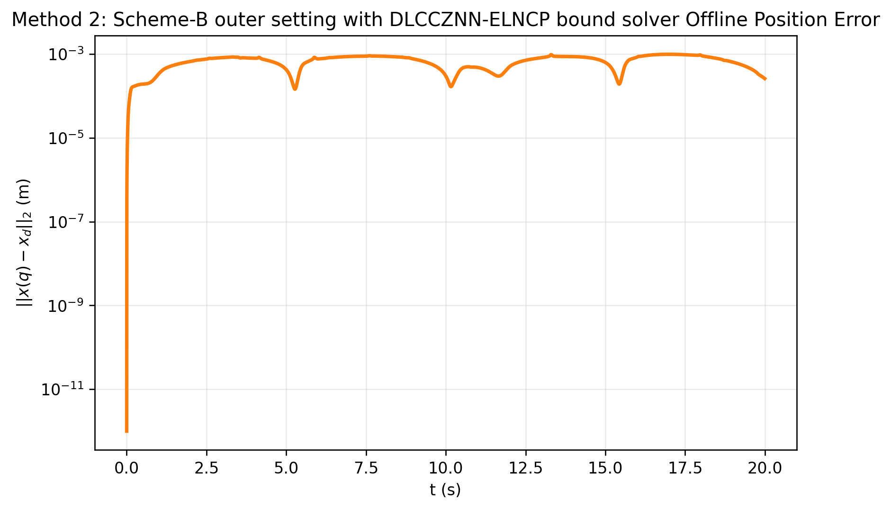
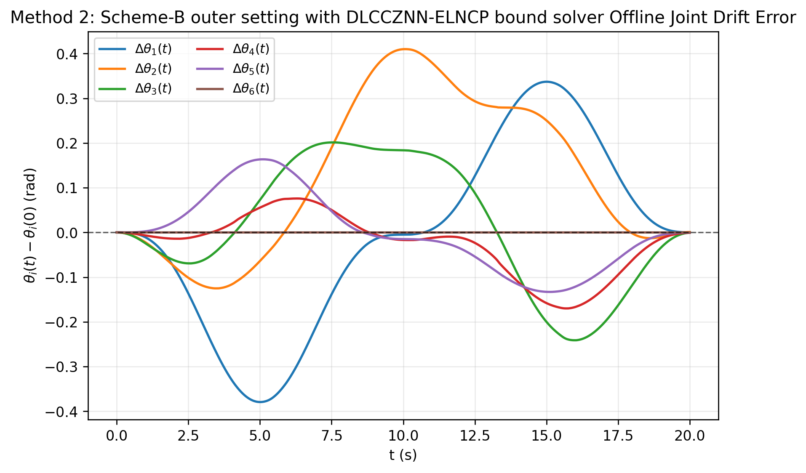
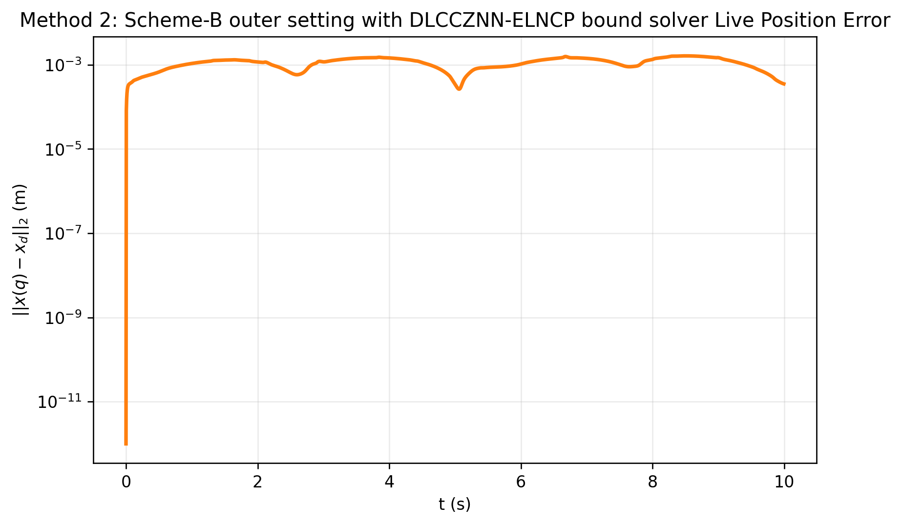
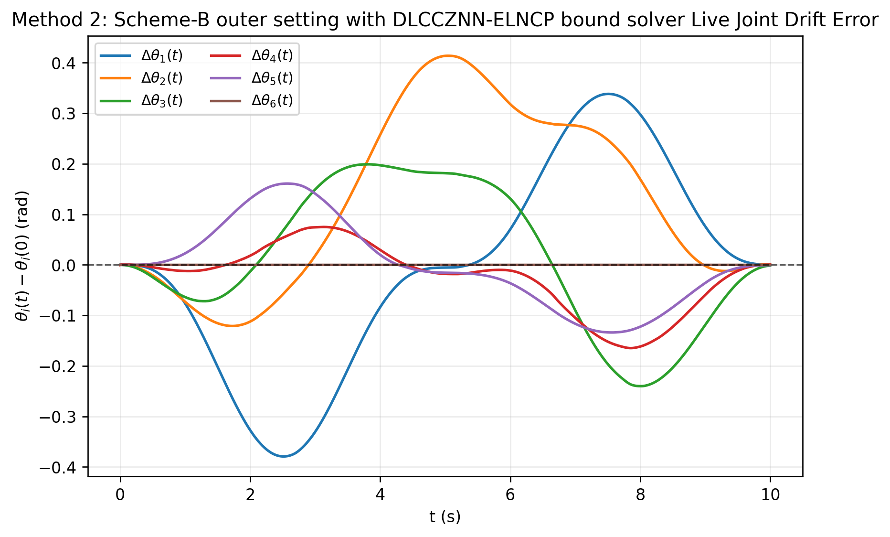

# Method 2 DLCCZNN 边界降维处理实验报告

## 1. 实验目标

本实验从目前效果最好的 `Method 2 -> DLCCZNN` 主线出发，只替换速度边界处理方式：

- 原始最好版本：在 DLCCZNN 内部每个子步后直接执行

$$
u\leftarrow \operatorname{clip}(u,\xi^-,\xi^+).
$$

- 本实验版本：将速度盒约束并入降维互补残差，使用 ELNCP 处理

$$
\xi^-\le u\le \xi^+.
$$

项目目录：

`C:\Users\lyx\Desktop\sci\code\project_method2_dlccznn_elncp_bounds`

主脚本：

`C:\Users\lyx\Desktop\sci\experiments\dlccznn_tvqp\project_method2_dlccznn_elncp_bounds\scripts\run_offline.py` ? `run_live.py`

## 2. 原始冻结 QP 残差

原 Method 2 DLCCZNN 每个采样时刻构造冻结 KKT 系统：

$$
Hy+p=0,
$$

其中

$$
y=
\begin{bmatrix}
u\\
\lambda
\end{bmatrix},
$$

$$
H=
\begin{bmatrix}
I & -J^T\\
J & 0
\end{bmatrix},
$$

$$
p=
\begin{bmatrix}
c\\
-b
\end{bmatrix}.
$$

这里 \(u=\dot q\)，\(b=\dot r_d-k_p e_p\)，\(c\) 为 Method 2 的漂移反馈项。

原始 DLCCZNN 子步更新为

$$
r=Hy+p,
$$

$$
v=\frac12 r^T r,
$$

$$
d=H^T r,
$$

$$
y^+=y-\Delta t\,
\gamma
\phi(v)
\frac{d}{d^T d+\rho}.
$$

随后对速度分量做直接裁剪：

$$
u^+=\operatorname{clip}(u^+,\xi^-,\xi^+).
$$

## 3. ELNCP 降维边界残差

本实验将状态扩展为

$$
\bar y=
\begin{bmatrix}
u\\
\lambda\\
\omega
\end{bmatrix},
$$

其中 \(\omega\ge0\) 是速度盒约束的辅助乘子。

定义下界和上界 slack：

$$
a_i=u_i-\xi_i^-,
\qquad
b_i=\xi_i^+-u_i.
$$

采用降维 slack：

$$
s_i=\min(a_i,b_i).
$$

使用 perturbed Fischer Burmeister 函数：

$$
\psi_\varepsilon(s_i,\omega_i)
=
s_i+\omega_i-\sqrt{s_i^2+\omega_i^2+\varepsilon}.
$$

分支方向为

$$
\frac{\partial s_i}{\partial u_i}
=
\begin{cases}
1,&s_i=a_i\\
-1,&s_i=b_i
\end{cases},
$$

并令

$$
\sigma_i=-\frac{\partial s_i}{\partial u_i}.
$$

于是扩展残差为

$$
\bar F(\bar y)=
\begin{bmatrix}
Hy+p\big|_{\mathrm{stationarity}}+\sigma\odot\omega\\
Hy+p\big|_{\mathrm{equality}}\\
\psi_\varepsilon(s,\omega)
\end{bmatrix}.
$$

DLCCZNN 标量能量为

$$
\bar v=\frac12\bar F^T\bar F.
$$

方向为

$$
\bar d=\bar F_{\bar y}^T\bar F.
$$

子步更新为

$$
\bar y^+
=
\bar y-\Delta t\,
\gamma
\phi(\bar v)
\frac{\bar d}{\bar d^T\bar d+\rho}.
$$

本实验中，求解器内部不再执行

$$
u\leftarrow \operatorname{clip}(u,\xi^-,\xi^+).
$$

但最终关节位置更新仍保留执行层安全保护：

$$
q_{k+1}
=
\operatorname{clip}(q_k+\tau u_k,q^{\min},q^{\max}).
$$

该保护只防止仿真执行越界，不是主约束处理机制。

## 4. 参数与稳定性

原始最好 live 配置为：

$$
k_p=220,\quad
\mu=20,\quad
r=0.85,\quad
N_s=80,\quad
\gamma=4608.
$$

直接使用该大增益替换为 ELNCP 后会发散，1 s offline 中出现：

$$
\min s=-5376.06,
$$

说明速度状态大幅越界，ELNCP 乘子来不及恢复。

稳定 sweep 后，当前可用配置为：

$$
k_p=220,\quad
\mu=20,\quad
r=0.85,\quad
N_s=120,\quad
\gamma=1000,\quad
\rho=10^{-2},\quad
\varepsilon=10^{-4}.
$$

live 为降低运行时间，采用：

$$
N_s=80,\quad
\gamma=1000,\quad
\rho=10^{-2},\quad
\varepsilon=10^{-4}.
$$

## 5. 结果对比

汇总表：

`C:\Users\lyx\Desktop\sci\code\project_method2_dlccznn_elncp_bounds\results\comparison_clip_vs_elncp.csv`

| 方法 | 模式 | 平均位置误差 (m) | 末端位置误差 (m) | 最终漂移范数 (rad) |
| --- | --- | ---: | ---: | ---: |
| 原始 clip 版 | offline | \(4.357\times10^{-6}\) | \(3.255\times10^{-6}\) | \(1.042\times10^{-5}\) |
| ELNCP 版 | offline | \(6.730\times10^{-4}\) | \(2.610\times10^{-4}\) | \(1.450\times10^{-3}\) |
| 原始 clip 版 | live | \(2.016\times10^{-4}\) | \(9.176\times10^{-5}\) | \(9.562\times10^{-4}\) |
| ELNCP 版 | live | \(1.104\times10^{-3}\) | \(3.533\times10^{-4}\) | \(2.444\times10^{-3}\) |

## 6. 结果图

ELNCP offline 位置误差：

ELNCP offline 角度漂移误差：

ELNCP live 位置误差：

ELNCP live 角度漂移误差：

## 7. 结论

1. ELNCP 替代内部 clip 后，速度边界确实作为残差进入求解器，最终实验中边界 slack 始终为正。

2. 但精度明显弱于原始 clip 版。offline 平均位置误差从 \(4.357\times10^{-6}\) m 增大到 \(6.730\times10^{-4}\) m，最终漂移从 \(1.042\times10^{-5}\) rad 增大到 \(1.450\times10^{-3}\) rad。

3. live 中也弱于原始 clip 版。平均位置误差从 \(2.016\times10^{-4}\) m 增大到 \(1.104\times10^{-3}\) m，最终漂移从 \(9.562\times10^{-4}\) rad 增大到 \(2.444\times10^{-3}\) rad。

4. 主要原因是原始 clip 是每个 DLCCZNN 子步后的强投影，能够立即把速度状态拉回可行盒；ELNCP 则把边界作为连续残差的一部分慢慢收敛，需要显著降低 solver gain 才稳定，导致 KKT 主残差收敛速度下降。

5. 当前结论是：对这套最强 Method 2 DLCCZNN 主线而言，直接把内部 clip 替换成 ELNCP 降维边界处理并不能提升精度，反而削弱了原来单步冻结 QP 的采样投影优势。

