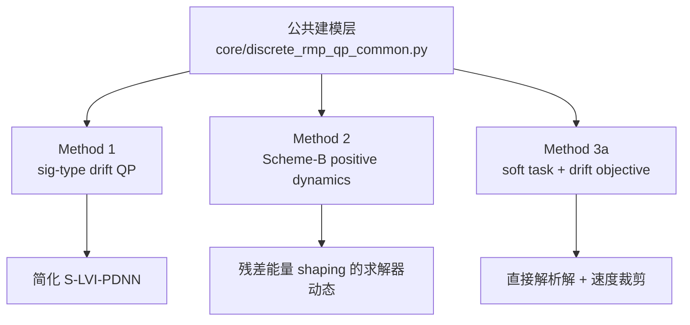

---
tags:
  - drift-free
  - RMP-QP
  - code-reading
  - obsidian
aliases:
  - 三种drift-free方法代码级推导
  - 三种方法代码级完整推导
---

# 三种 drift-free 方法代码级完整推导

> [!abstract] 这份文档在做什么
> 这份文档把当前工程里三种主方法的推导过程，按“实验入口 -> 公共建模层 -> 各方法代码实现 -> 数学公式”的顺序重新整理成一份适合在 Obsidian 中长期阅读的总稿。
> 
> 重点不是只给结论，而是解释清楚：
> 1. 三种方法到底对应哪些代码。
> 2. 为什么 Method 1 / Method 2 的 QP 约束右端是任务反馈速度而不是纯任务速度。
> 3. 为什么 Method 3a 从根本上不同于前两种。

> [!info] 相关文档
> - [[README_项目导航]]
> - [[三种方法公式与逻辑总览]]
> - [[三种方法详细公式推导]]
> - [[method3a_formula_summary]]
> - [[method_parameter_effects]]
> - [[从零开始运行实验教程]]
> - [[实验结果分组差异说明]]
> - [[最终检查报告]]

> [!tip] 建议阅读顺序
> 先看 [[三种方法公式与逻辑总览]] 建立大图景，再看本篇把代码和公式一一对上，最后回到 [[三种方法详细公式推导]] 做压缩复习。

## 0. 先把“对应代码文件”说清楚

这是最容易混淆的地方。

当前工程里真正被实验脚本作为“三种主方法”调用的是：

- `method1_sig_rmp_qp`
- `method2_scheme_b_positive`
- `method3a_position_and_drift`

它们在当前主实现中并不是三个独立主文件，而是都定义在同一个文件里：

- `core/discrete_rmp_qp_integrated_methods.py`

公共层统一放在：

- `core/discrete_rmp_qp_common.py`

如果按“历史拆分版”的物理文件看，则三种方法分别对应：

- `legacy/method_packages/METHOD1_SIG_RMP_QP/controller.py`
- `legacy/method_packages/METHOD2_SCHEME_B/controller.py`
- `legacy/method_packages/METHOD3_VARIANTS/controller.py`

但根据 [[README_项目导航]]，`legacy/` 只是参考，不是当前主入口。因此本篇推导统一以 `core/` 下的当前主实现为准。

### 0.1 当前主实现与历史拆分实现的对应关系

| 方法 | 当前主实现 | 历史拆分参考 | 本篇采用 |
| --- | --- | --- | --- |
| Method 1 | `Method1SigRMPQPController` | `METHOD1_SIG_RMP_QP/controller.py` | 当前主实现 |
| Method 2 | `Method2SchemeBController` | `METHOD2_SCHEME_B/controller.py` | 当前主实现 |
| Method 3a | `Method3aPositionDriftController` | `METHOD3_VARIANTS/controller.py` | 当前主实现 |

### 0.2 三种方法在当前工程里的位置关系

## 1. 公共建模层

三种方法虽然形式不同，但它们共享同一套机器人模型、同一套误差定义、同一套离散步长 $\tau$，以及同一套关节速度边界。

### 1.1 基本变量

| 变量 | 含义 |
| --- | --- |
| $q_k$ | 第 $k$ 步当前关节角 |
| $q_0$ | 初始关节角 |
| $\dot q_k$ | 第 $k$ 步要求解的关节速度 |
| $x(q_k)$ | 当前末端位置 |
| $x_d(k)$ | 第 $k$ 步期望末端位置 |
| $\dot r_d(k)$ | 第 $k$ 步期望任务空间速度 |
| $J_k$ | 第 $k$ 步任务雅可比矩阵 |
| $\tau$ | 外层离散控制步长 |

在当前代码里，这些公共量由 `build_step_data(...)` 统一构造。

### 1.2 两个核心误差

位置误差定义为

$$
e_p(k)=x(q_k)-x_d(k).
$$

漂移误差定义为

$$
e_d(k)=q_k-q_0.
$$

在代码中的名字分别是：

- `position_error`
- `drift_delta`

它们的物理含义是：

- $e_p(k)$ 衡量末端是否跟上任务轨迹。
- $e_d(k)$ 衡量关节是否偏离周期起点姿态。

### 1.3 任务反馈速度与纯任务速度

当前主实现同时保留了两个任务速度量：

任务反馈速度

$$
b_{\mathrm{fb}}(k)=\dot r_d(k)-k_p\,e_p(k),
$$

纯任务速度

$$
b_{\mathrm{pure}}(k)=\dot r_d(k).
$$

其中 $k_p$ 对应代码里的 `task_gain`。

这两个量不是重复定义，而是承担不同角色：

- `Method 1` 和 `Method 2` 把 $b_{\mathrm{fb}}(k)$ 直接作为等式约束右端。
- `Method 3b` 则按结构要求把 $b_{\mathrm{pure}}(k)$ 作为硬约束右端。

### 1.4 为什么 Method 1 / Method 2 的约束右端不是纯任务速度

这是一个关键点。

公共一步线性化给出

$$
x(q_{k+1}) \approx x(q_k)+\tau J_k \dot q_k,
$$

并且期望轨迹离散为

$$
x_d(k+1) \approx x_d(k)+\tau \dot r_d(k).
$$

因此位置误差传播满足

$$
\begin{aligned}
e_p(k+1)
&=x(q_{k+1})-x_d(k+1) \\
&\approx e_p(k)+\tau\big(J_k\dot q_k-\dot r_d(k)\big).
\end{aligned}
$$

如果你把硬约束写成纯任务速度

$$
J_k\dot q_k=\dot r_d(k),
$$

代回去就得到

$$
e_p(k+1)\approx e_p(k).
$$

这意味着在这个一阶模型下，已有位置误差不会自动收缩；系统只是在“跟着期望速度跑”，而没有闭环纠偏。

如果约束写成任务反馈速度

$$
J_k\dot q_k=\dot r_d(k)-k_p e_p(k),
$$

则有

$$
\begin{aligned}
e_p(k+1)
&\approx e_p(k)+\tau\big(-k_p e_p(k)\big) \\
&=(1-\tau k_p)e_p(k).
\end{aligned}
$$

这就变成了显式的闭环误差收缩。

所以对 `Method 1 / Method 2` 而言，约束右端写成 $b_{\mathrm{fb}}(k)$ 不是随意选择，而是因为它们本来就属于“保留传统闭环任务约束外壳”的方法。

### 1.5 一步线性化与误差传播

三种方法都建立在同一套一步近似上。

末端位置的一阶近似为

$$
x(q_{k+1}) \approx x(q_k)+\tau J_k\dot q_k.
$$

关节更新为

$$
q_{k+1}=q_k+\tau \dot q_k.
$$

于是位置误差传播式可以写成

$$
e_p(k+1)\approx e_p(k)+\tau\big(J_k\dot q_k-\dot r_d(k)\big),
$$

如果把任务反馈项并入下一步误差目标，则写成

$$
e_p(k+1)\approx e_p(k)+\tau\big(J_k\dot q_k-\dot r_d(k)+k_p e_p(k)\big).
$$

漂移误差传播式为

$$
\begin{aligned}
e_d(k+1)
&=q_{k+1}-q_0 \\
&=e_d(k)+\tau \dot q_k.
\end{aligned}
$$

后面三种 drift-free 处理都可以视为在利用这条漂移传播式。

### 1.6 速度边界是怎么来的

已知关节位置约束

$$
\theta_{\min} \le q_k \le \theta_{\max},
$$

下一步还要满足

$$
\theta_{\min}\le q_k+\tau \dot q_k \le \theta_{\max}.
$$

移项后得到由位置边界诱导出的速度区间

$$
\frac{\theta_{\min}-q_k}{\tau}
\le
\dot q_k
\le
\frac{\theta_{\max}-q_k}{\tau}.
$$

再和电机物理速度上限

$$
\dot\theta_{\min}\le \dot q_k \le \dot\theta_{\max}
$$

求交集，代码最终使用

$$
\xi^{-}(k)=\max\!\left(\dot\theta_{\min},\frac{\eta}{\tau}(\theta_{\min}-q_k)\right),
$$

$$
\xi^{+}(k)=\min\!\left(\dot\theta_{\max},\frac{\eta}{\tau}(\theta_{\max}-q_k)\right).
$$

其中 $\eta$ 是收缩系数，用来避免当前步把关节直接推进边界之外。

### 1.7 Method 1 与 Method 2 共用的 KKT / LVI 外壳

Method 1 和 Method 2 都可以先写成同一个约束二次规划：

$$
\begin{aligned}
\min_{\dot q_k}\quad &
\frac{1}{2}\dot q_k^\top W \dot q_k+\hat c(k)^\top \dot q_k \\
\text{s.t.}\quad &
J_k\dot q_k=b_{\mathrm{fb}}(k), \\
&
\xi^{-}(k)\le \dot q_k \le \xi^{+}(k).
\end{aligned}
$$

其中

$$
W=\texttt{weight\_gain}\,I.
$$

令

$$
y=
\begin{bmatrix}
\dot q \\
\lambda
\end{bmatrix},
$$

并采用代码中的乘子符号约定

$$
L(\dot q,\lambda)
=
\frac{1}{2}\dot q^\top W \dot q
+\hat c^\top \dot q
-\lambda^\top (J\dot q-b_{\mathrm{fb}}).
$$

则一阶条件为

$$
W\dot q+\hat c-J^\top \lambda=0,
$$

$$
J\dot q-b_{\mathrm{fb}}=0.
$$

拼成块矩阵就是

$$
H=
\begin{bmatrix}
W & -J^\top \\
J & 0
\end{bmatrix},
\qquad
p=
\begin{bmatrix}
\hat c \\
-b_{\mathrm{fb}}
\end{bmatrix}.
$$

于是无盒约束时满足

$$
Hy+p=0.
$$

加入盒约束后，代码使用投影残差

$$
r(y)=P_\Omega\!\big(y-(Hy+p)\big)-y.
$$

平衡点满足

$$
r(y^\star)=0.
$$

这正是后面 Method 1 和 Method 2 构造求解器动态的起点。

## 2. Method 1: sig 型漂移偏置 + 线性残差投影动态

对应当前主实现：

- `core/discrete_rmp_qp_integrated_methods.py` 里的 `Method1SigRMPQPController`

### 2.1 它想解决什么

Method 1 的思想很朴素：

1. 任务层仍然要求末端跟踪轨迹。
2. 在 QP 目标中额外加入一个“往初始姿态拉回去”的漂移偏置项。
3. 再用简化的 S-LVI-PDNN 去求这个带约束 QP。

因此它保留的是“传统闭环约束 QP 外壳”，改变的是“漂移项如何进入目标函数”。

### 2.2 从代码读出漂移反馈项

代码里的 sig 激活函数是

$$
\phi_{\mathrm{sig}}(z_i)
=
\operatorname{sign}(z_i)\,|z_i|^r \exp\!\big(\min(|z_i|,\text{clip})\big).
$$

因此 Method 1 的漂移反馈向量为

$$
\hat c(k)=\mu\,\phi_{\mathrm{sig}}\!\big(e_d(k)\big).
$$

逐分量理解：

- $\operatorname{sign}(z_i)$ 保证方向始终朝 $0$ 回拉。
- $|z_i|^r$ 让小误差区依旧保持非线性灵敏性。
- $\exp(\min(|z_i|,\text{clip}))$ 让大误差区的回拉更强，但又不会指数爆炸。

### 2.3 Method 1 的完整优化问题

Method 1 对应的优化问题是

$$
\begin{aligned}
\min_{\dot q_k}\quad &
\frac{1}{2}\dot q_k^\top W \dot q_k+\hat c(k)^\top \dot q_k \\
\text{s.t.}\quad &
J_k\dot q_k=b_{\mathrm{fb}}(k), \\
&
\xi^{-}(k)\le \dot q_k \le \xi^{+}(k).
\end{aligned}
$$

其中

$$
b_{\mathrm{fb}}(k)=\dot r_d(k)-k_p e_p(k),
\qquad
W=\texttt{weight\_gain}\,I.
$$

如果暂时忽略全部约束，只看目标函数本身，则一阶条件为

$$
W\dot q_k+\hat c(k)=0,
$$

因此无约束极小点是

$$
\dot q_k^\star=-W^{-1}\hat c(k).
$$

这说明：

- 当某个关节漂移 $e_{d,i}(k)>0$ 时，$\hat c_i(k)>0$，于是 $\dot q_i^\star<0$。
- 当某个关节漂移 $e_{d,i}(k)<0$ 时，$\hat c_i(k)<0$，于是 $\dot q_i^\star>0$。

所以它天然具有“谁偏了谁往回走”的 drift-free 趋势。

### 2.4 为什么会得到 KKT / LVI 形式

加上等式约束 $J_k\dot q_k=b_{\mathrm{fb}}(k)$ 后，拉格朗日函数为

$$
L(\dot q,\lambda)
=
\frac{1}{2}\dot q^\top W \dot q
+\hat c^\top \dot q
-\lambda^\top (J\dot q-b_{\mathrm{fb}}).
$$

分别对 $\dot q$ 和 $\lambda$ 求偏导：

$$
\frac{\partial L}{\partial \dot q}
=
W\dot q+\hat c-J^\top \lambda
=0,
$$

$$
\frac{\partial L}{\partial \lambda}
=
-(J\dot q-b_{\mathrm{fb}})
=0.
$$

于是得到

$$
\begin{bmatrix}
W & -J^\top \\
J & 0
\end{bmatrix}
\begin{bmatrix}
\dot q \\
\lambda
\end{bmatrix}
+
\begin{bmatrix}
\hat c \\
-b_{\mathrm{fb}}
\end{bmatrix}
=0,
$$

也就是

$$
Hy+p=0.
$$

### 2.5 代码里的 S-LVI-PDNN 更新律是怎么来的

当前公共求解器的核心更新是

$$
y_{\ell}^{\text{in}}=y_\ell-(Hy_\ell+p),
$$

$$
\bar y_\ell=P_\Omega\!\left(y_{\ell}^{\text{in}}\right),
$$

$$
r_\ell=\bar y_\ell-y_\ell,
$$

$$
y_{\ell+1}=y_\ell+\tau_s\gamma r_\ell.
$$

这四步可以这样理解：

1. $y_\ell-(Hy_\ell+p)$ 表示先朝着满足 $Hy+p=0$ 的方向迈一步。
2. $P_\Omega(\cdot)$ 把这一步重新投影回可行盒约束。
3. $\bar y_\ell-y_\ell$ 就是投影残差。
4. 最终更新律用这个残差来驱动离散动力学。

因此 Method 1 的求解器本质上是一个线性投影残差驱动的离散神经动力学。

### 2.6 Method 1 的一句话本质

$$
\text{Method 1}
=
\text{传统 drift-free 约束 QP}
+\text{sig 型漂移线性项 } \hat c
+\text{线性投影残差驱动的 S-LVI-PDNN}.
$$

## 3. Method 2: QP 不变，改求解器残差能量 shaping

对应当前主实现：

- `core/discrete_rmp_qp_integrated_methods.py` 里的 `Method2SchemeBController`

### 3.1 它和 Method 1 共用什么

Method 2 没有重写任务层，也没有重写约束层。

它仍然从这个问题出发：

$$
\begin{aligned}
\min_{\dot q_k}\quad &
\frac{1}{2}\dot q_k^\top W \dot q_k+\hat c(k)^\top \dot q_k \\
\text{s.t.}\quad &
J_k\dot q_k=b_{\mathrm{fb}}(k), \\
&
\xi^{-}(k)\le \dot q_k \le \xi^{+}(k).
\end{aligned}
$$

并继续使用

$$
\hat c(k)=\mu\,\phi_{\mathrm{sig}}\!\big(e_d(k)\big).
$$

因此它和 Method 1 共享：

- 同样的 Jacobian
- 同样的任务反馈 $b_{\mathrm{fb}}$
- 同样的漂移偏置 $\hat c$
- 同样的速度边界

### 3.2 真正变化发生在求解器层

Method 2 先和 Method 1 一样构造

$$
H=
\begin{bmatrix}
W & -J^\top \\
J & 0
\end{bmatrix},
\qquad
p=
\begin{bmatrix}
\hat c \\
-b_{\mathrm{fb}}
\end{bmatrix},
\qquad
y=
\begin{bmatrix}
\dot q \\
\lambda
\end{bmatrix}.
$$

然后仍然定义

$$
y_{\ell}^{\text{in}}=y_\ell-(Hy_\ell+p),
$$

$$
\bar y_\ell=P_\Omega\!\left(y_{\ell}^{\text{in}}\right),
$$

$$
r_\ell=\bar y_\ell-y_\ell.
$$

但它不再直接用 $r_\ell$ 做线性更新，而是先衡量“当前离投影平衡点还有多远”。

### 3.3 残差能量

代码中定义残差能量

$$
E_{\mathrm{res}}(\ell)=\frac{1}{2}\|r_\ell\|_2^2.
$$

这一步的含义是：

- Method 1 只关心往哪个方向修正。
- Method 2 进一步关心当前残差的能量有多大。

如果残差还很大，说明还远离投影平衡点，更新就应该更激进；如果残差已经很小，就应该自动降温。

### 3.4 正函数激活和非线性增益

代码中的正函数激活写成

$$
\phi_{+}(s)=\max(s,0)^r\exp\!\big(\min(\max(s,0),\text{clip})\big).
$$

于是非线性增益定义为

$$
g_\ell=1+\mu\,\phi_{+}\!\big(E_{\mathrm{res}}(\ell)\big).
$$

注意：

- $E_{\mathrm{res}}(\ell)\ge 0$，所以它天然适合做正函数激活。
- $g_\ell\ge 1$，因此这个 shaping 本质上是在必要时放大更新速度，而不是改变残差方向。

### 3.5 更新律是怎样推出来的

Method 1 的更新律为

$$
y_{\ell+1}=y_\ell+\tau_s\gamma r_\ell.
$$

Method 2 则把它改成

$$
y_{\ell+1}=y_\ell+\tau_s\gamma g_\ell r_\ell.
$$

也就是说，原来的线性更新增益 $\gamma$ 被替换成了自适应增益 $\gamma g_\ell$。

于是：

- 残差大时，$E_{\mathrm{res}}(\ell)$ 大，$g_\ell$ 大，收敛推进更激进。
- 残差小时，$E_{\mathrm{res}}(\ell)$ 小，$g_\ell$ 逼近 $1$，动态自动回到接近 Method 1 的温和模式。

### 3.6 为什么说它是“Scheme-B positive dynamics”

因为它并没有改原始二次目标的物理含义，而是对“求解器动态系统”的右端做了正函数非线性整形：

$$
\dot y = \gamma\,g(E_{\mathrm{res}})\,r(y).
$$

代码里则是它的离散 Euler 形式：

$$
\texttt{state\_dot}=\gamma\,g(E_{\mathrm{res}})\,r,
$$

$$
\texttt{state\_next}=\texttt{state}+\tau_s\,\texttt{state\_dot}.
$$

### 3.7 Method 2 的一句话本质

$$
\text{Method 2}
=
\text{Method 1 的 QP 外壳}
+\text{对投影残差能量做正函数非线性 shaping}
+\text{因此改变的是求解器动态，而不是目标函数建模层}.
$$

## 4. Method 3a: 直接最小化“下一步位置误差 + 下一步漂移误差”

对应当前主实现：

- `core/discrete_rmp_qp_integrated_methods.py` 里的 `Method3aPositionDriftController`

> [!important] 这是三种方法里最本质不同的一个
> Method 1 和 Method 2 都还停留在“传统约束 QP 外壳”里。
> Method 3a 则直接把下一步误差本身写成目标函数，不再依赖 $J\dot q=b_{\mathrm{fb}}$ 这层老壳。

### 4.1 它的出发点与前两种完全不同

Method 1 / Method 2 问的是：

$$
\text{怎样在满足任务约束的同时，再通过漂移项把关节拉回去？}
$$

Method 3a 问的则是：

$$
\text{如果现在选一个 }\dot q_k,\text{ 那么下一步位置误差和漂移误差分别会是多少？}
$$

于是它直接最小化：

$$
\|\text{下一步位置误差}\|_2^2+\|\text{下一步漂移误差}\|_2^2.
$$

### 4.2 下一步位置误差目标是怎么来的

由公共层的一步传播式

$$
e_p(k+1)\approx e_p(k)+\tau\big(J_k\dot q_k-\dot r_d(k)+k_p e_p(k)\big),
$$

得到位置目标

$$
\mathcal J_p
=
\alpha
\left\|
e_p(k)+\tau\big(J_k\dot q_k-\dot r_d(k)+k_p e_p(k)\big)
\right\|_2^2,
$$

其中

$$
\alpha=\texttt{position\_weight}.
$$

### 4.3 下一步漂移误差目标是怎么来的

由漂移传播式

$$
e_d(k+1)=e_d(k)+\tau \dot q_k,
$$

得到漂移目标

$$
\mathcal J_d
=
\beta
\left\|
e_d(k)+\tau \dot q_k
\right\|_2^2,
$$

其中

$$
\beta=\texttt{drift\_weight}.
$$

### 4.4 总目标函数

把两项相加，Method 3a 的总代价就是

$$
\begin{aligned}
\min_{\dot q_k}\quad &
\alpha
\left\|
e_p(k)+\tau\big(J_k\dot q_k-\dot r_d(k)+k_p e_p(k)\big)
\right\|_2^2 \\
&\quad +
\beta
\left\|
e_d(k)+\tau \dot q_k
\right\|_2^2 \\
\text{s.t.}\quad &
\xi^{-}(k)\le \dot q_k \le \xi^{+}(k).
\end{aligned}
$$

注意这里已经没有传统硬约束

$$
J_k\dot q_k=b_{\mathrm{fb}}(k).
$$

任务误差已经被吸收入目标函数，变成了软目标。

### 4.5 先把位置项整理一下

定义中间量

$$
a_p
=
e_p(k)+\tau\big(-\dot r_d(k)+k_p e_p(k)\big).
$$

则位置目标可以写成

$$
\mathcal J_p
=
\alpha\left\|a_p+\tau J_k\dot q_k\right\|_2^2.
$$

又因为

$$
\frac{a_p}{\tau}
=
\left(\frac{1}{\tau}+k_p\right)e_p(k)-\dot r_d(k),
$$

所以代码里使用的 `position_drive` 正是

$$
\texttt{position\_drive}
=
\left(\frac{1}{\tau}+k_p\right)e_p(k)-\dot r_d(k).
$$

### 4.6 把总目标展开成标准二次型

先展开位置项：

$$
\begin{aligned}
\mathcal J_p
&=
\alpha\left(a_p+\tau J_k\dot q_k\right)^\top
\left(a_p+\tau J_k\dot q_k\right) \\
&=
\alpha a_p^\top a_p
+2\alpha\tau a_p^\top J_k\dot q_k
+\alpha\tau^2 \dot q_k^\top J_k^\top J_k \dot q_k.
\end{aligned}
$$

再展开漂移项：

$$
\begin{aligned}
\mathcal J_d
&=
\beta\left(e_d(k)+\tau \dot q_k\right)^\top
\left(e_d(k)+\tau \dot q_k\right) \\
&=
\beta e_d(k)^\top e_d(k)
+2\beta\tau e_d(k)^\top \dot q_k
+\beta\tau^2 \dot q_k^\top I \dot q_k.
\end{aligned}
$$

两项相加后，所有与 $\dot q_k$ 无关的常数项都可以丢掉，因为它们不影响最优解。

于是只保留与 $\dot q_k$ 有关的部分：

$$
\begin{aligned}
F(\dot q_k)
=\;&
\alpha\tau^2 \dot q_k^\top J_k^\top J_k \dot q_k
+2\alpha\tau a_p^\top J_k\dot q_k \\
&+
\beta\tau^2 \dot q_k^\top I\dot q_k
+2\beta\tau e_d(k)^\top \dot q_k.
\end{aligned}
$$

对它求梯度：

$$
\nabla F(\dot q_k)
=
2\alpha\tau^2 J_k^\top J_k\dot q_k
+2\alpha\tau J_k^\top a_p
+2\beta\tau^2 \dot q_k
+2\beta\tau e_d(k).
$$

令梯度为零，并除以 $2\tau$：

$$
\alpha\tau J_k^\top J_k\dot q_k
+\alpha J_k^\top a_p
+\beta\tau \dot q_k
+\beta e_d(k)
=0.
$$

再整体除以 $\tau$：

$$
\big(\alpha J_k^\top J_k+\beta I\big)\dot q_k
+\alpha J_k^\top \left(\frac{a_p}{\tau}\right)
+\beta \frac{e_d(k)}{\tau}
=0.
$$

代回

$$
\frac{a_p}{\tau}
=
\left(\frac{1}{\tau}+k_p\right)e_p(k)-\dot r_d(k),
$$

得到

$$
\big(\alpha J_k^\top J_k+\beta I\big)\dot q_k
+\alpha J_k^\top
\left[
\left(\frac{1}{\tau}+k_p\right)e_p(k)-\dot r_d(k)
\right]
+\beta \frac{e_d(k)}{\tau}
=0.
$$

于是可以写成标准二次型

$$
\min_{\dot q_k}
\quad
\frac{1}{2}\dot q_k^\top Q_k \dot q_k+c_k^\top \dot q_k,
$$

其中

$$
Q_k=\alpha J_k^\top J_k+\beta I,
$$

$$
c_k=
\alpha J_k^\top
\left[
\left(\frac{1}{\tau}+k_p\right)e_p(k)-\dot r_d(k)
\right]
+\beta \frac{e_d(k)}{\tau}.
$$

### 4.7 为什么代码里会出现 $\beta W$

当前代码不是直接写 $\beta I$，而是写成

$$
Q_k=\alpha J_k^\top J_k+\beta W+\varepsilon I,
$$

其中

$$
W=\texttt{weight\_gain}\,I.
$$

所以当 `weight_gain = 1` 时，它就退化成最常见的

$$
Q_k=\alpha J_k^\top J_k+\beta I+\varepsilon I.
$$

这里额外的 $\varepsilon I$ 只是数值正则项，对应代码中的 `regularization_gain`。

### 4.8 为什么 Method 3a 直接求解析解

Method 3a 当前这个问题已经没有等式硬约束，因此最自然的最优性条件就是

$$
Q_k \dot q_{\mathrm{raw}}+c_k=0.
$$

只要 $Q_k$ 正定或近似正定，就有

$$
\dot q_{\mathrm{raw}}=-Q_k^{-1}c_k.
$$

代码随后再做一步速度裁剪：

$$
\dot q_{\mathrm{cmd}}
=
\operatorname{clip}\!\big(\dot q_{\mathrm{raw}},\xi^{-}(k),\xi^{+}(k)\big).
$$

这比继续再套一层 PDNN 更稳定，也更符合 Method 3a 当前的数学结构。

### 4.9 Method 3a 的一句话本质

$$
\text{Method 3a}
=
\text{直接离散化“下一步位置误差 + 下一步漂移误差”}
+\text{把两者写成统一的标量二范数目标}
+\text{再求出关节速度层的最优解}.
$$

## 5. 三种方法到底改了哪一层

| 方法 | 保留了什么 | 改了什么 | 最核心公式 |
| --- | --- | --- | --- |
| Method 1 | 传统约束 QP 外壳、任务硬约束、速度边界 | 漂移线性项 $\hat c$ 和线性投影残差求解 | $\hat c=\mu\,\phi_{\mathrm{sig}}(e_d)$ |
| Method 2 | 与 Method 1 相同的 QP 外壳 | 求解器动态的残差能量 shaping | $y_{\ell+1}=y_\ell+\tau_s\gamma g(E_{\mathrm{res}})r_\ell$ |
| Method 3a | Jacobian、误差定义、速度边界 | 目标函数建模层本身 | $\min \alpha\|e_p(k+1)\|_2^2+\beta\|e_d(k+1)\|_2^2$ |

## 6. 一眼看懂三种方法

> [!summary] 三句话总结
> - Method 1：在传统约束 QP 里加一个 sig 型漂移偏置项。
> - Method 2：QP 不换，但求解器按残差能量自适应调增益。
> - Method 3a：不再沿用老 QP 外壳，直接把下一步位置误差和漂移误差写成优化目标。

## 7. 建议的代码阅读顺序

如果接下来还要继续手读代码，建议按这个顺序：

1. 先读 `core/discrete_rmp_qp_integrated_methods.py` 里的 `build_step_data(...)`
   先把 $e_p(k)$、$e_d(k)$、$b_{\mathrm{fb}}(k)$、$b_{\mathrm{pure}}(k)$ 的来源看明白。
2. 再读 `core/discrete_rmp_qp_common.py` 里的 `compute_dynamic_velocity_bounds(...)`
   把速度边界怎么从位置边界变过来搞清楚。
3. 再看 `Method1SigRMPQPController`
   先掌握最传统的 drift-free QP 外壳。
4. 接着看 `Method2SchemeBController`
   专门盯着 `residual_energy` 和 `nonlinear_gain` 看。
5. 最后看 `Method3aPositionDriftController`
   重点对照 `position_drive`、`q_matrix`、`q_vector` 这三行。

## 8. 结论

三种方法虽然都服务于 drift-free 目标，但它们并不处在同一个改造层级上：

- Method 1 改的是漂移项如何进入传统约束 QP。
- Method 2 改的是这个约束 QP 的求解器动态。
- Method 3a 改的是目标函数建模层本身。

这也是为什么在当前工程里：

- Method 1 更像基线 drift-free QP。
- Method 2 更像“保留 PDNN 思想后的非线性求解器增强版”。
- Method 3a 更像“从离散误差传播重新设计目标函数”的新方案。

> [!seealso] 延伸阅读
> 如果你接下来想继续往下接：
> - 看全局结构：[[三种方法公式与逻辑总览]]
> - 看精炼公式版：[[三种方法详细公式推导]]
> - 单看 Method 3a：[[method3a_formula_summary]]
> - 看参数影响：[[method_parameter_effects]]
> - 看实验入口：[[从零开始运行实验教程]]
