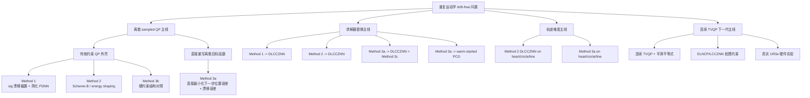

---
tags:
  - drift-free
  - method-map
  - decision
  - obsidian
aliases:
  - 当前方法知识脉络
  - 方法总盘点
  - 2026-04-27方法决策地图
---

# 当前方法知识脉络与决策地图

> [!abstract]
> 这份笔记把我们目前已经提出、已经实操、已经验证，和还停留在下一步构想层的方法，按“大类到小类”的方式串成一张图。
> 它的用途不是替代公式推导，而是回答三个更直接的问题：
> 1. 我们现在到底有几条方法主线。
> 2. 每条主线里哪些方法已经跑通，效果好坏如何。
> 3. 下一步最值得深挖的是哪一条。

> [!info] 关联笔记
> - [[三种方法公式与逻辑总览]]
> - [[三种方法详细公式推导]]
> - [[三种drift-free方法代码级完整推导]]
> - [[method3a_formula_summary]]
> - [[method_parameter_effects]]
> - [[实验结果分组差异说明]]

> [!note]
> 本页里默认优先引用当前仍保留在工作区中的结果与调参总结。
> 对于已经被清理掉原始结果目录、但在后续总结文档中仍有保留结论的方法，我会明确写成“历史基线口径”。

![[method_knowledge_map_20260427.png]]

## 1. 一眼看懂的大脉络

我们目前的工作，不是简单地从 Method 1、Method 2、Method 3a 线性推进，而是已经分裂成了四个层级分明的研究簇：

1. **离散 sampled QP 主线**
   这是最早、也是目前证据最完整的一条主线。它又分成两类：
   - 保留传统约束 QP 外壳的路线：`Method 1`、`Method 2`、`Method 3b`
   - 直接重写离散目标函数的路线：`Method 3a`

2. **求解器替换主线**
   这条线的核心问题不是“换目标函数”，而是“同一个外层问题，换一种更低复杂度或更匹配结构的求解器会怎样”。
   已经做过的替换包括：
   - `Method 1 -> DLCCZNN`
   - `Method 2 -> DLCCZNN`
   - `Method 3a -> DLCCZNN`，即 `Method 3c`
   - `Method 3a -> warm-started PCG`

3. **轨迹难度主线**
   这条线不是新方法，而是用更简单、终点静止的轨迹去检查方法本身的上限和稳定性。
   目前已经做过：
   - `heart`
   - `circle`
   - `line`

4. **下一代连续 TVQP 主线**
   这条线目前还没有真正落地实验，但已经形成了比较清晰的下一步方向：
   - 从“每步冻结成静态 QP”转到“连续时变 TVQP”
   - 从 `clip + max/min` 转到平滑不等式与 ELNCP/LCCZNN 风格处理
   - 把 `Method 3` 一类的方法从根上重写成更适合 LCCZNN 的结构

## 2. 方法树

## 3. 当前所有方法的状态卡

### 3.1 评级口径

- `A`: 已经形成很清楚的价值，可继续作为主打方向。
- `B`: 已经跑通，有研究价值，但更适合作为配角或对照。
- `C`: 已实操，但结果说明这条路当前不适合作为主线。
- `D`: 目前还是构想，尚未真正完成代码与实验闭环。

### 3.2 总表

| 方法 | 所属大类 | 当前状态 | 当前最好或代表性结果 | 评价 | 结论等级 |
| --- | --- | --- | --- | --- | --- |
| `Method 1` 原始版 | 离散 sampled QP，传统约束壳层 | 已实现，历史基线口径保留 | 离线最终漂移约 `1.889e-2 rad`，live 最终漂移约 `2.677e-1 rad` | 结构清楚，但精度和 drift-free 能力都偏弱 | `B-` |
| `Method 2` 原始版 | 离散 sampled QP，传统约束壳层 | 已实现并长期作为主基线 | 代表性离线结果：最终漂移约 `1.894e-5 rad`，平均位置误差约 `3.669e-4 m` | 结构最适合讲“传统 QP 壳层下的 drift-free”，精度明显优于 Method 1，但不如 Method 3a | `B+` |
| `Method 3a` 直接求解版 | 离散 sampled QP，直接重写目标函数 | 已实现并多轮验证 | 离线极限结果可到最终漂移 `1.281e-7 rad`；heart live 代表性结果约为最终漂移 `4.192e-4 rad`、平均位置误差 `1.308e-4 m` | 当前总体精度最强，是“数据最好”的方法 | `A` |
| `Method 3b` 硬约束对照版 | 离散 sampled QP，传统约束壳层 | 已实现，但当前无保留正式结果链 | 主要定位是结构对照，不是冲精度主力 | 能帮我们解释结构差异，但不适合继续深挖成主方法 | `C+` |
| `Method 1 -> DLCCZNN` | 求解器替换 | 已完成 offline 和 live | 离线最终漂移 `1.035e-2 rad`；live 最终漂移 `2.673e-1 rad` | 比原始 Method 1 略好，但没有改变它作为弱基线的地位 | `B-` |
| `Method 2 -> DLCCZNN` | 求解器替换 | 已完成 offline、live、调参 | 当前 best live：平均位置误差 `2.466e-4 m`，最终位置误差 `1.043e-4 m`，最终漂移 `1.430e-3 rad` | 这是目前最成功的 DLCCZNN 落地线，结构与故事都最稳 | `A-` |
| `Method 3a -> DLCCZNN = Method 3c` | 求解器替换 | 已完成 offline 和 live | 离线最终漂移 `4.472e-1 rad`；live 最终漂移 `6.273e-1 rad`，虽然位置误差仍小 | 这是一个很重要的负结果：位置精度还在，但 drift-free 核心能力明显坏掉 | `C` |
| `Method 3a -> warm-started PCG` | 求解器替换 | 已完成 offline、live、调参 | 当前 best live：平均位置误差 `1.302e-4 m`，最终位置误差 `5.815e-5 m`，最终漂移 `3.197e-4 rad` | 这是目前最成功的 Method 3a 替代求解器，几乎保住了它的强精度 | `A` |
| `Method 2 DLCCZNN + simple shapes` | 轨迹难度主线 | 已完成 heart、circle、line | offline：`line` 最好，平均位置误差 `1.871e-5 m`，最终漂移 `1.173e-6 rad`；live：最终漂移仍大致卡在 `4.4e-3 rad` 带 | 简单轨迹能明显降位置误差，但对 live 漂移带改善有限 | `B+` |
| `Method 3a + simple shapes` | 轨迹难度主线 | 已完成 heart、circle、line | offline：`circle` 可到 `2.969e-11 rad`；live：`line` 平均位置误差 `5.624e-5 m`，最终漂移约 `4.183e-4 rad` | 说明 Method 3a 的高精度不是偶然，结构上确实非常强 | `A` |
| 连续 TVQP + 平滑不等式 + ELNCP/LCCZNN | 下一代连续主线 | 只有推导方向，还未成型 | 尚无正式代码和实验结果 | 这是最值得作为下一阶段核心突破口的方向 | `D+` |
| 真实 UR3e 硬件实验 | 工程验证主线 | 尚未开展 | 暂无 | 对投工程类期刊非常关键，但目前还只是待完成项 | `D` |

## 4. 现在最重要的认识

### 4.1 真正最强的方法，不止一条

从“纯结果最好”这个角度看，当前第一梯队其实有两条：

1. `Method 3a` 直接求解版  
   它是当前精度最高、表现最稳定、simple shape 下上限最高的方法。

2. `Method 3a + PCG`  
   它不是全新外层方法，但作为“替代直接求解器”的路线，目前是最成功的近似保真替代。

如果只看“最适合讲 DLCCZNN/LCCZNN 故事”的方向，那最强的是：

1. `Method 2 -> DLCCZNN`

因为它是目前唯一一条既保住了原来结构逻辑，又在 live 中实现了比较像样 drift-free 效果的低复杂度神经求解路线。

### 4.2 最重要的负结果同样很值钱

`Method 3c` 不是失败到没有价值，恰恰相反，它告诉了我们一个非常关键的结构事实：

> 对 `Method 3a` 这一类“直接重写离散目标函数”的方法来说，内层求解精度已经和外层 drift-free 恢复紧紧绑在一起了。  
> 换句话说，`Method 3a` 不是随便拿一个低复杂度残差跟踪器都能代掉直接求解。

这条负结果，正是把我们推向“连续 TVQP 重构”的理论动机。

### 4.3 简单轨迹实验已经回答了一个关键问题

最开始我们看到 simple shape 下角度误差变大，后来把轨迹改成 rest-to-rest 之后，结论就清楚了：

1. 不是方法本身突然坏了。
2. 是轨迹设计如果末端速度不回零，会污染 drift-free 判断。
3. 一旦轨迹边界条件合理，simple shape 的结果会进一步放大 Method 3a 和 Method 2 DLCCZNN 的结构差异。

所以这条线后面仍然值得保留，但它更适合做“补充验证”和“图更好看”的支线，不适合取代主问题本身。

## 5. 还没有真正完成的部分

下面这些不是“还可以再优化”，而是“目前还没有形成闭环证据”的部分：

1. **连续 TVQP 重构**
   目前只有明确的理论方向，还没有真正替换掉现有 sampled static QP 代码链。

2. **平滑不等式与 ELNCP/LCCZNN 约束处理**
   当前主代码依然主要靠 `clip` 和动态速度边界。
   我们已经确认，下一代版本更适合把这部分重写成连续不等式残差系统。

3. **真实 UR3e 硬件实验**
   目前还停留在 CoppeliaSim live。
   对后续投控制工程实践类期刊，这一块迟早要补。

## 6. 如果现在要决定“下一步深挖哪条线”

按“理论价值 + 当前证据缺口 + 最可能带来新突破”的综合排序，我建议优先级如下。

### 第一优先级

**连续 TVQP + 平滑不等式 + ELNCP/LCCZNN**

原因很直接：

1. 它正面回应了 `Method 3c` 为什么坏掉这个核心问题。
2. 它能把你今天提出的“不再用 `max/min`，而是直接用连续不等式约束”的想法真正落进统一框架。
3. 它最有机会把 `Method 3` 重新变成适合 LCCZNN 的问题，而不是继续在不匹配的离散静态壳层里硬替换。

### 第二优先级

**Method 2 DLCCZNN 的进一步定型**

如果你想先稳住一条“已经能讲故事、也已经有 live 数据”的主线，那它仍然是最适合继续做论文主体的一条。

### 第三优先级

**真实 UR3e 硬件实验**

它现在不是理论突破点，但会是后面决定论文能否更像工程论文的关键一跳。

## 7. 一句话压缩结论

如果把目前所有工作压成一句话，那就是：

> 我们已经走出了两条成熟主线：  
> 一条是 **`Method 3a / Method 3a + PCG` 的高精度路线**，  
> 另一条是 **`Method 2 -> DLCCZNN` 的结构匹配路线**；  
> 而真正最值得继续深挖的新方向，是把 `Method 3` 从 sampled static QP 彻底重构成 **连续 TVQP + 平滑不等式 + LCCZNN/ELNCP** 的新框架。
